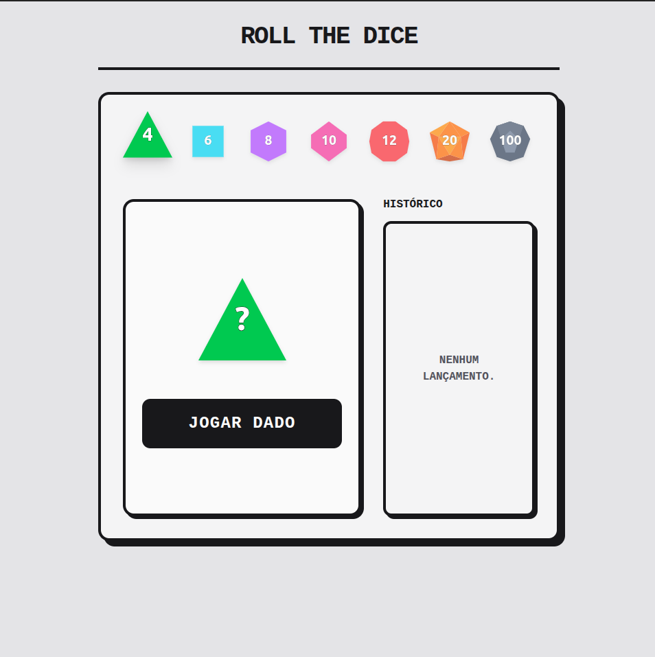
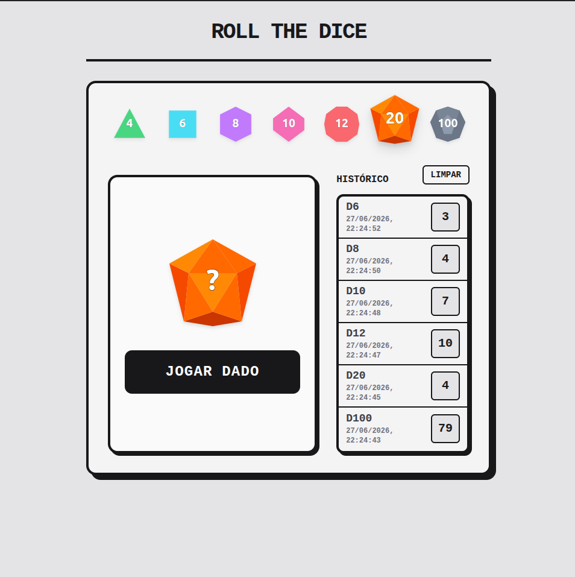

# Roll The Dice

Este projeto foi desenvolvido como parte de um desafio técnico full-stack. A aplicação permite que o usuário selecione modelos clássicos de dados (D4, D6, D8, D10, D12, D20, D100), solicite uma rolagem ao servidor e visualize o resultado, além de manter um histórico completo das jogadas.

## Tecnologias Utilizadas

**Front-end:**

- React
- TypeScript
- Vite
- Tailwind CSS
- Fetch API (para comunicação com o back-end)

**Back-end:**

- Node.js
- Express
- TypeScript
- MySQL (Banco de dados)
- Cors

## Pré-requisitos

Antes de iniciar, certifique-se de ter as seguintes ferramentas instaladas em sua máquina:

- [Node.js](https://nodejs.org/) (v18 ou superior recomendado)
- [MySQL](https://www.mysql.com/) (Servidor rodando localmente)

## Instalação e Configuração

Siga os passos abaixo para rodar o projeto localmente:

### 1. Banco de Dados (MySQL)

Abra o seu terminal ou cliente MySQL e execute o seguinte script para criar o banco e a tabela necessários:

```sql
CREATE DATABASE roll_the_dice;
USE roll_the_dice;

CREATE TABLE rolls (
  id INT AUTO_INCREMENT PRIMARY KEY,
  diceType VARCHAR(10) NOT NULL,
  result INT NOT NULL,
  created_at TIMESTAMP DEFAULT CURRENT_TIMESTAMP
);
```

Na pasta principal faça uma cópia do arquivo .env.example e renomeie-a para .env. Abra o novo arquivo .env e preencha as variáveis DB_USER e DB_PASS com as credenciais do seu próprio banco de dados MySQL local.

### 2. Configurando o Back-end

Abra um terminal e acesse a pasta do servidor:

```
    # Entre na pasta do back-end
    cd backend

    # Instale as dependências
    npm install

    # Inicie o servidor de desenvolvimento
    npm run dev
```

O servidor estará rodando na porta 3000 (http://localhost:3000).

### 3. Configurando o Front-end

Abra um novo terminal e acesse a pasta do front-end:

```
    # Entre na pasta do front-end
    cd frontend

    # Instale as dependências
    npm install

    # Inicie a aplicação
    npm run dev
```

A aplicação abrirá no seu navegador, geralmente na porta 5173 (http://localhost:5173).

### Como Usar

1. Na interface principal, clique sobre o dado desejado (D4, D6, D8, D10, D12, D20 ou D100).

2. Clique no botão "Rolar Dado".

3. O front-end enviará a requisição para a API, que validará o modelo, sorteará o número e salvará no banco de dados.

4. O resultado aparecerá cravado no dado principal, e o painel lateral de Histórico será atualizado instantaneamente com o registro da jogada, exibindo o tipo, o valor e a data/hora exata.

5. Para limpar os registros, utilize o botão "Limpar" no painel de histórico.

## Demonstração da Interface




## Autor

Desenvolvido por Marcos Vinícius.
